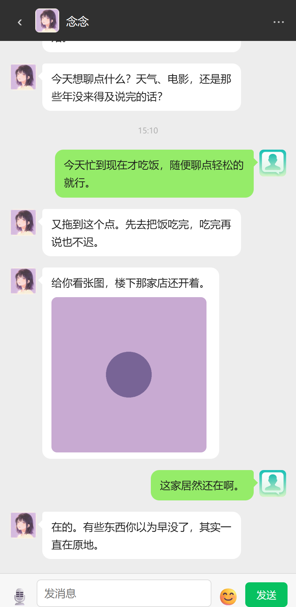

# first-love-ai

[](https://github.com/ypx-xyz/first-love-ai/actions/workflows/ci.yml)


一个"爱而不得的初恋"主题的 **AI 陪伴聊天应用**（前端 demo + 通用人格蒸馏机制）。

用一句话概括：把一段没能走到最后的感情，做成一个可以随时对话的陪伴者——TA 记得你们之间那些没说完的话，等你有一天回来慢慢说。

> ⚠️ **免责声明**：本项目中的所有示例语料、角色、对话均为**虚构**，仅作技术演示。不指向任何真实人物或真实关系。请勿对号入座。

## 在线演示

👉 **界面演示**：<https://ypx-xyz.github.io/first-love-ai/>

> Pages 上的是**静态界面演示**（回复由前端模拟），用于预览交互与观感；真实回复由「人格蒸馏 + 回复生成 prompt」驱动，需按下文在本地运行。

<p align="center">
  
  
</p>

## 这是什么

- 一个微信风格的本地聊天网页（Flask 后端 + 原生前端），开箱可跑
- 陪伴者（assistant）由外部进程/AI 注入回复，通过一套通用 API 与前端解耦
- 附带一套**通用人格蒸馏机制**（见 [`persona/`](persona/)），可从任意文本语料提炼可模仿的人格画像

## 快速开始

```bash
# 安装依赖
pip install -r requirements.txt

# 启动（Windows）——自动拉起 Flask 并打开浏览器
python launcher.py

# 或直接启动
python app.py
# 浏览器访问 http://localhost:5000
```

## 功能

- 本地消息持久化（`messages.json`），并发安全写入 + 原子替换
- 增量拉取（`?since_id=`），前端轮询只取新消息，减少传输
- 写前自动备份，保留最近 60 份，可回滚
- 图片服务（`/api/images/`），陪伴者可分享图片
- 表情代码 → emoji 映射（支持 `[可爱]` 这类短码）
- 时间分隔线、打字指示、空状态等微信风格交互
- 回复前置检查脚本（`check_reply.py`），生成前先取上下文简报

## 目录结构

```
first-love-ai/
├── app.py                    # Flask 后端（通用聊天 API）
├── check_reply.py            # 回复前置检查：输出上下文简报（JSON）
├── reply.py                  # 回复链路：检查 → 调 LLM 生成 → 写回聊天页
├── launcher.py               # Windows 启动器
├── requirements.txt          # 依赖
├── sample_messages.json      # 虚构示例对话（"初恋重逢"开场）
├── templates/index.html      # 前端聊天界面
├── static/                   # 头像、示例图片
├── docs/                     # 静态界面演示（GitHub Pages）
├── examples/
│   └── send_reply.py         # 注入陪伴者回复的示例脚本
├── tests/
│   ├── smoke_test.py         # 单元测试（仅标准库）
│   ├── e2e_test.py           # 端到端测试（临时端口拉起服务）
│   ├── launcher_test.py      # 启动器端口选择逻辑测试
│   └── llm_reply_test.py     # 回复链路测试（假 LLM + 假聊天服务，不联网）
├── .github/workflows/ci.yml  # CI：语法检查 + 四组测试（多 Python 版本）
└── persona/                  # 人格机制（纯技术描述）
    ├── personify_prompt.md   # 通用人格蒸馏 prompt（离线）
    ├── reply_prompt.md       # 回复生成 prompt（在线）
    ├── architecture.md       # 蒸馏引擎架构
    └── persona.example.json  # 人格画像示例（字段与 prompt 占位一一对应）
```

## 如何注入陪伴者回复

陪伴者的回复由你自己的逻辑生成（LLM、规则引擎、定时任务均可）。可参考
[`persona/reply_prompt.md`](persona/reply_prompt.md) 生成回复文本，再用
[`examples/send_reply.py`](examples/send_reply.py) 或下面的接口写入：

```bash
curl -s -X POST http://localhost:5000/api/messages/assistant \
  -H "Content-Type: application/json" \
  -d '{"text":"今天过得怎么样？"}'
```

可选的图片：

```bash
curl -s -X POST http://localhost:5000/api/messages/assistant \
  -H "Content-Type: application/json" \
  -d '{"text":"给你看张图","image":"sample.png"}'
```

图片文件放在 `static/images/` 下即可。

## 回复前置检查：check_reply.py

在生成回复**之前**先跑一次检查脚本，拿到当前时间、时段、待回复消息、最近对话脉络、近 3 天已讲过的内容、可发图片与随机骰子——避免「凭印象写回复」。

```bash
python check_reply.py            # 输出带缩进的 JSON 简报
python check_reply.py --compact  # 单行 JSON，便于管道处理
```

关键字段：

| 字段 | 含义 |
|---|---|
| `now` / `now_phase` | 当前时间 / 时段（清晨…凌晨），写问候、提休息前必看 |
| `has_reply` | 是否存在**待回复**的用户消息；`false` 时生成方应直接结束任务 |
| `pending` | 待回复的用户消息列表 |
| `context` | 最近 40 条对话脉络（`u:` 用户 / `x:` 陪伴者，含图片标记） |
| `recent_replies` | 最近 3 天陪伴者的回复（**防复读**依据） |
| `candidate_images` | 可发图片（已排除近期发过的） |
| `img_roll` | 0~1 随机数；脚本只给骰子，是否带图由生成方按 `< 0.30` 决定 |
| `learning` | 可选，读了 `learning.json` 则有值，否则为 null |

脚本**只读不写**、不联网、不调用 LLM，仅依赖标准库，可安全高频运行。

## 接入真实 LLM：reply.py

[`persona/reply_prompt.md`](persona/reply_prompt.md) 是「怎么生成」的规范，`reply.py` 是把规范跑起来的那条链路：

```
check_reply.build_report()            # 只读检查：待回复 / 上下文 / 防复读 / 候选图
        ↓
reply_prompt.md + persona.json        # 组装 system / user 两条消息
        ↓
POST {LLM_BASE_URL}/chat/completions  # OpenAI 兼容接口，默认 DeepSeek
        ↓
POST {CHAT_BASE_URL}/api/messages/assistant   # 逐条写回聊天页
```

### 用法

```bash
export LLM_API_KEY=sk-xxxx            # Windows: set LLM_API_KEY=sk-xxxx

python reply.py --dry-run             # 只打印将要发送的提示词，不调用 LLM、不写入
python reply.py                       # 完整链路：检查 → 生成 → 写回聊天页
python reply.py --print-only          # 调用 LLM 但只打印结果，满意再写入
```

### 环境变量

| 变量 | 必填 | 默认值 | 说明 |
|---|---|---|---|
| `LLM_API_KEY` | 是 | — | 接口密钥，**只从环境变量读** |
| `LLM_BASE_URL` | 否 | `https://api.deepseek.com/v1` | 任何 OpenAI 兼容接口均可，如本地 ollama 的 `http://127.0.0.1:11434/v1` |
| `LLM_MODEL` | 否 | `deepseek-chat` | 模型名 |
| `LLM_TIMEOUT` | 否 | `90` | 单次请求超时（秒） |
| `LLM_TEMPERATURE` | 否 | `1.0` | 采样温度 |
| `CHAT_BASE_URL` | 否 | `http://127.0.0.1:5000` | 聊天服务地址 |
| `CHAT_DATA_DIR` | 否 | 仓库目录 | 数据目录（内含 `messages.json`） |

换提供方只需改前三个变量，不动代码。需要显式 JSON 模式（部分服务要求）加 `--json-mode`；不开也能跑——解析器会从 Markdown 代码块或前后说明文字里把 JSON 抠出来。

### 退出码

| 码 | 含义 |
|---|---|
| `0` | 正常（含最常见的「无待回复消息、未调用 LLM」） |
| `1` | 配置问题（缺 API key / 提示词或人格文件缺失） |
| `2` | LLM 调用失败，或输出无法解析 |
| `3` | 回复已生成但写回聊天服务失败（原文会打印出来，可手工补发） |

### 为什么是独立脚本，而不是服务内自动回复

`reply_prompt.md` 的分批节奏、防复读窗口、时段规则都建立在「**无新消息直接结束是常态**」之上；用户一发消息就即时回，会把这套节奏冲掉。所以它刻意不做成服务内钩子，而是独立进程——手动跑、挂定时任务、接自己的编排都可以。

### 隐私提示

真实人格画像请放 `persona/persona.json`：该文件已在 `.gitignore` 中，不会入库，仓库只保留 `persona/persona.example.json` 这份虚构示例。密钥一律走环境变量，不写进任何文件。

## 人格蒸馏与回复生成

陪伴者的「人味」来自两段 prompt：

- **离线蒸馏** [`persona/personify_prompt.md`](persona/personify_prompt.md)：从任意文本语料提炼人格画像（语气指纹 + 人格维度），架构见 [`persona/architecture.md`](persona/architecture.md)
- **在线回复** [`persona/reply_prompt.md`](persona/reply_prompt.md)：消费人格画像，在对话中生成 1-6 条口语化、分条、去重防复读的回复

核心链路：

**语料采集 → 清洗 → 增量去重 → 语气特征提取 → 人格画像 → 消息生成 → 质量校准**

配套示例 [`examples/send_reply.py`](examples/send_reply.py) 演示如何把生成的回复注入应用。

蒸馏引擎只做统计与特征提取，不输出语料原文；请自行评估所用语料的合规性与授权。

## 进阶：LLM + Wiki 协同模式

更进一步的做法，是让 LLM 与一个**可编辑的记忆 Wiki** 协同工作：

- **可编辑的记忆 Wiki**：既支持人工维护，也可由 Agent 自动维护
- **虚拟人格**：在 Wiki 中建立目标人格条目，并随对话与素材持续迭代
- **两条定时主线**：蒸馏任务与回复任务是日常维护的两个主线，随着 Wiki 的维护不断迭代升级
- **多源语料持续获取**：蒸馏可不断采集目标人物的各类信息——聊天记录、语音、邮件、公开动态、创作作品等
- **工具选择**：目前主流支持「LLM + Wiki」协同的 Agent 是**灵犀专业版**；WorkBuddy、豆包等则需要外置 LLM + Wiki

## API 一览

| 方法 | 路径 | 说明 |
|---|---|---|
| GET | `/` | 前端页面 |
| GET | `/api/messages` | 全量 / 增量拉取消息 |
| POST | `/api/messages` | 用户发送消息 |
| POST | `/api/messages/assistant` | 注入陪伴者回复 |
| GET | `/api/images/<filename>` | 服务图片 |
| GET | `/api/stats` | 消息统计 |
| GET | `/api/backups` | 备份列表 |

## 测试

全部测试**只用标准库**（不需要额外的测试框架），本地直接跑：

```bash
python -m py_compile app.py check_reply.py reply.py launcher.py examples/send_reply.py
python tests/smoke_test.py      # 单元测试：字段结构、回复判定、参数容错、脏数据降级
python tests/e2e_test.py        # 端到端：随机空闲端口拉起真实服务，走完整链路
python tests/launcher_test.py   # 启动器：端口上跑着别的程序时不被误判
python tests/llm_reply_test.py  # 回复链路：假 LLM + 假聊天服务，不联网不花钱
```

`e2e_test.py` 会在随机空闲端口拉起 `app.py`（数据目录指向临时目录，不污染仓库），依次验证发消息、异常请求体拒绝、注入回复、全量/增量拉取、统计、备份、图片服务、落盘，以及数据文件损坏时的降级行为。四项测试均以退出码 0 表示通过，同时由 GitHub Actions 在多个 Python 版本上自动执行（见顶部 CI 徽章）。`llm_reply_test.py` 用进程内起的假 LLM 与假聊天服务把整条链路跑通——含正常生成、提示词组装、`--dry-run` / `--print-only`、缺密钥、LLM 报错、输出非法、写回失败等分支，全程不联网、不消耗额度。

> **关于端口**：Windows 允许多个进程同时监听同一端口，Flask 也不会报错，请求会被路由到先启动的那个进程。所以 `launcher.py` 不会只看「端口有没有在监听」，而是确认端口上跑的到底是不是本应用：是就打开页面，不是就顺延换端口；`app.py` 启动前也会显式拦一道并提示换端口。测试时请始终使用随机空闲端口，不要用 5000。

## License

[MIT](LICENSE)
