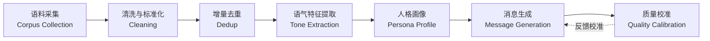

# 人格蒸馏引擎架构

本文档描述聊天应用中"陪伴者人格"的构建链路。整体是一个**离线蒸馏 + 在线生成**的
两段式 pipeline，全程以通用文本处理技术实现，与具体语料来源解耦。

## 整体流程



## 模块说明

| 模块 | 输入 | 输出 | 关键技术点 |
|---|---|---|---|
| 语料采集 | 原始文本文件 | 结构化语料条目 | 支持 .txt/.md/.json，统一解析为 `{id, text, time}` 条目 |
| 清洗与标准化 | 原始条目 | 干净条目 | 去空行、去乱码、时间戳解析为可排序元组 |
| 增量去重 | 干净条目 + 状态文件 | 仅新增条目 | 基于语料条目的唯一 ID 集合，替代易错的字符串时间戳比对，修复跨月/同分钟漏蒸 |
| 语气特征提取 | 新增条目 | 语气指纹 | 高频语气词/口语词统计、省略号频次、emoji 集合、自称与情绪词 |
| 人格画像 | 语气指纹 + 上下文语料 | 人格维度 | 归纳核心人格维度、边界感、表达风格 |
| 消息生成 | 人格画像 + 用户最新消息 | 陪伴者回复 | 可接入任意 LLM 或规则引擎，按人格画像约束语气 |
| 质量校准 | 近期虚拟回复 vs 真实语料 | 风格偏差点 | 防回声室：虚拟回复仅作校准，核心模仿源必须是真实语料 |

## 关键设计决策

1. **蒸馏与生成解耦**：离线蒸馏只产出"人格画像"，在线生成消费画像，两者通过配置文件对接，便于替换生成后端。
2. **增量去重**：用条目唯一 ID 集合记录已处理进度，支持 `--reset` 全量重蒸，也支持跨期稳定增量。
3. **多源语料**：主源 + 技术语气语料 + 虚拟回复校准源，权重分层：主源定调、技术语料为辅、虚拟回复仅校准。
4. **防回声室**：若虚拟回复过度模板化/越界/与真实语料不符，校准模块标记偏差并回写修正，避免自我复制失真。

## 与聊天应用的数据流

```
[离线] 蒸馏引擎 ──产出──> 人格画像(persona.json)
                              │
[在线] 消息生成模块 ──读取──> 人格画像
                              │
        生成回复 ──POST──> /api/messages/assistant
                              │
                          messages.json（持久化）
```

## 合规与隐私

- 蒸馏引擎只做统计与特征提取，不输出语料原文，不回显任何可识别个人的片段
- 本仓库不含任何真实语料，示例人格与对话均为虚构
- 实际使用前，使用者需自行评估语料来源的合规性与授权
